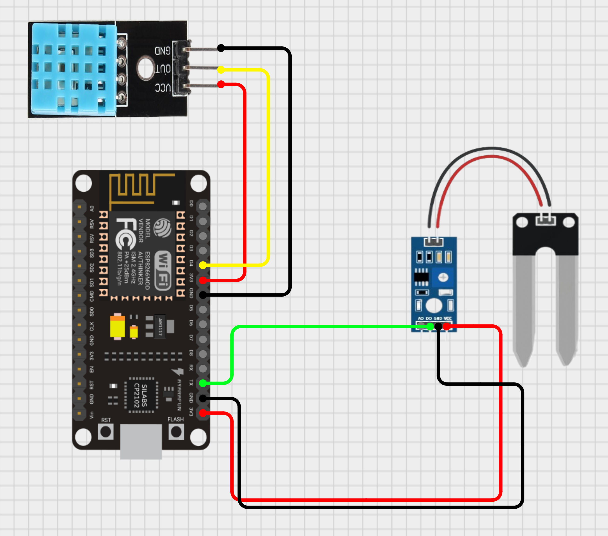

# **NodeMCU Weather Station**
This project outlines the development of a weather station using a NodeMCU ESP8266 microcontroller to measure temperature, humidity, and soil moisture and subsequently transmit this data to the Arduino Cloud platform. This setup enables the remote monitoring of environmental conditions, making it suitable for applications in agriculture, home automation, and environmental science.

## **Requirements**
```
  1. NodeMCU                (Microcontroller)
  2. DHT11 OR DHT22 Sensor  (Temperature & Humidity)
  3. Soil Moisture Sensor   (Any)
  4. Arduino IDE            (Coding the NodeMCU)
  5. USB to Micro-USB Cable (For Uploading the Code)
  6. Arduino Cloud          (Viewing the Data Sent by the Node MCU)
```
## **Wiring Diagram**



## **Code Explanation**

The NodeMCU reads data from the DHT11 and soil moisture sensors and sends it to the Arduino Cloud. Here's how the code works:

1. **Include Libraries:** Includes necessary libraries for Wi-Fi, Arduino Cloud, DHT sensor, and potentially the soil moisture sensor.  
2. **Define Variables:** Defines variables for sensor pins, Arduino Cloud connection details, and sensor data.  
3. **Initialize Setup:**  
   * Initializes serial communication.  
   * Connects to Wi-Fi.  
   * Connects to Arduino Cloud.  
   * Configures the DHT sensor.  
   * Sets the pin mode for the soil moisture sensor (if using digital output).  
4. **Read Sensor Data:**  
   * Reads temperature and humidity from the DHT11 sensor.  
   * Read the analog value from the soil moisture sensor. Optionally, reads the digital value.  
5. **Send Data to Arduino Cloud:** Sends the temperature, humidity, and soil moisture data to Arduino Cloud.  
6. **Delay:** Waits for a specified interval before repeating the process.

## **Installation and Setup**

1. **Hardware Assembly:** Connect the sensors to the NodeMCU according to the wiring diagram.  
2. **Software Installation:**  
   * Download and install the Arduino IDE from the official Arduino website.  
   * Install the ESP8266 board package in the Arduino IDE (if not already installed).  
   * Install the DHT libraries through the Arduino IDE's library manager by searching DHT and installing the Adafruit Version.  
3. **Arduino Cloud Setup:**  
   * Create an Arduino Cloud account.  
   * Create a new Thing in Arduino Cloud and configure the variables for temperature, humidity, and soil moisture.
   * Obtain the Thing ID, device ID, and secret key from Arduino Cloud.  
4. **Code Configuration:**  
   * Open the Arduino code in the Arduino IDE.  
   * Enter your Wi-Fi credentials, Arduino Cloud device credentials, and Thing ID in the code.  
   * Select the correct NodeMCU board from the Tools \> Board menu.  
   * Select the correct port from the Tools \> Port menu.  
5. **Code Upload:** Upload the code to the NodeMCU.

## **Troubleshooting**

* **Cannot connect to Wi-Fi:** Check Wi-Fi credentials and network connectivity.  
* **Cannot connect to Arduino Cloud:** Check Arduino Cloud credentials, Thing ID, and internet connectivity.  
* **Sensor data is incorrect:** Check sensor wiring, sensor functionality, and data conversion in the code.  
* **No data in Arduino Cloud:** Ensure the NodeMCU is sending data and the variables in the code match those in your Arduino Cloud Thing.

## **Future Improvements**

* Will add more sensors (e.g., barometric pressure, rainfall)  
* Trying to implement data logging to local storage (e.g., SD card)  
* Will create a custom dashboard for data visualization (It is already available in Arduino Cloud)  
* Will implement alerts and notifications for extreme weather conditions  
* Will add over-the-air (OTA) updates for the NodeMCU firmware
