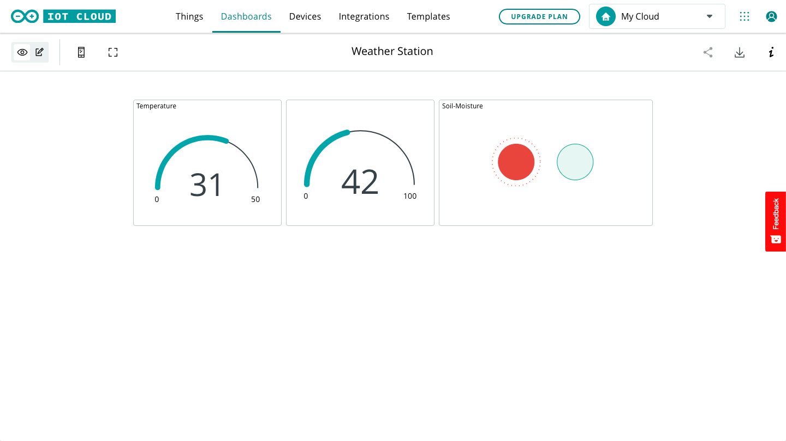
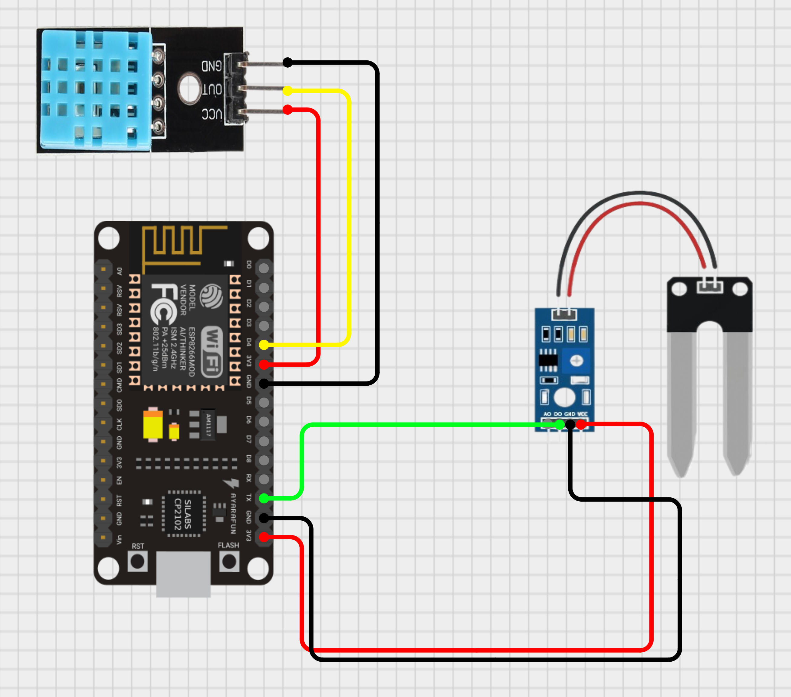

# NodeMCU Weather Station

NodeMCU is a great tool for Iot projects. Today, we are going to talk how to make a Weather Station that can show you the Temperature, Humidity and Soil Moisture of the surrounding area through Arduino Cloud.

You will need:
```
  1. NodeMCU                (Microcontroller)
  2. DHT11 OR DHT22 Sensor  (Temperature & Humidity)
  3. Soil Moisture Sensor   (Any)
  4. Arduino IDE            (Coding the NodeMCU)
  5. USB to Micro-USB Cable (For Uploading the Code)
  6. Arduino Cloud          (Viewing the Data Sent by the Node MCU)
```

First, Open Arduino IDE and install Adafruit DHT Library. Then Download the Code and open it with the Arduino IDE. Next Enter your Wi-Fi SSID, Password and Secret Key [^1], which is provided by Arduino Cloud. Then Upload the Code and Enjoy.

Wait! There is more. Go to the [Arduino Website](https://www.arduino.cc) and login into your Arduino SSO Account.Then got to the Iot Cloud Section and click on the `CREATE` button. Enter the details and you will get a secret key[^1]. Copy it. Just in case. Now, click on the `ADD` button and enter the variable, one at a time!

```
  1. temperature (Save as int)
  2. humidity    (Save as int)
  3. soil        (Save as bool)
```

After that, go to `Dashboards` tab and click on `CREATE` button. Then click on `ADD` button and add 2 Gauges and 1 Light Indicator one at a time. Your dashboard should look like this.



Now you have to connect the NodeMCU with the DHT11 or DHTT22 Sensor and Soil Moisture Sensor. Please follow the Scematics for easy wiring.



The last step is to upload the code and you are ready to go!!!

### Thank You!!!
> #### More Updates Coming Soon!
